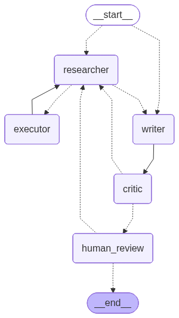

# Туристический ассистент (LangGraph)

## Назначение

Этот ассистент сделан исключительно в образовательных целях, для понимания работы графа состояний и взаимодействия с инструментами в фреймвворке LangGraph.

Агент составляет **культурную программу поездки** по городу и датам: билеты туда-обратно (самолёт, поезд, автобус), **три альтернативных маршрута** на всю поездку (варианты A/B/C) с досугом из **Wikidata** (координаты для Яндекс.Карт), и лайфхаки. **Билеты** — структурированные **deep links** (`search_roundtrip_tickets`, JSON `schema_version=1`). **Маршруты** — общий пул POI (`search_route_materials`) + structured `routes` и markdown `routes_text`; ссылки на маршрут в картах собирает код (`maps_route_url`). Перед планированием — **опросник** (состав группы; темп и транспорт фиксированы в коде); поездки, предпочтения и версии программы хранятся в **SQLite**. Старые программы с разделами `events`/`dining` по-прежнему отображаются в вебе и CLI.

## Статус и планы

Приложение находится **в стадии активной разработки**. Текущая версия — **минимальная рабочая (MVP)**: агент собирает билеты, три маршрута и лайфхаки, веб и CLI позволяют сохранять поездки, оценивать пункты и пересобирать разделы. Интерфейс, качество маршрутов и интеграции будут дорабатываться.

**Ближайшие планы:**

| Направление | Что планируется |
|-------------|-----------------|
| **Отели** | Отдельная вкладка с отелями вдоль маршрута; переход к бронированию (affiliate / партнёрские ссылки) |
| **Маршруты** | Улучшить построение пешеходных маршрутов на основе выгрузок [Geofabrik](https://download.geofabrik.de/) (OSM: дорожная сеть, пешеходные зоны, точнее км и связность остановок) |
| **SaaS** | Многопользовательский режим: регистрация, личный кабинет, изоляция поездок по аккаунту (вместо локальной SQLite на одного пользователя) |

## Быстрый старт

### Требования

- Python **3.10+** (рекомендуется **3.11**; на macOS не используйте системный `python3` 3.9)
- Ключ **OpenRouter** ([openrouter.ai/keys](https://openrouter.ai/keys))

### Установка и запуск

```bash
git clone <url-репозитория>
cd tourist-assistant

python3.11 -m venv .venv
source .venv/bin/activate
# Windows: py -3.11 -m venv .venv && .venv\Scripts\activate
# macOS: если python3.11 нет — brew install python@3.11
python --version  # должно быть 3.10+

pip install -r requirements.txt

cp .env.example .env
# Отредактируйте .env: LLM_API_KEY=sk-or-...

python3 main.py
```

### Веб-интерфейс (FastAPI + React)

Требования: Python 3.10+, Node.js 20+, те же ключи в `.env`.

**Терминал 1 — API:**

```bash
source .venv/bin/activate
pip install -r requirements.txt
uvicorn api.main:app --reload --port 8000
```

**Терминал 2 — фронтенд:**

```bash
cd web
npm install
npm run dev
```

Откройте [http://localhost:5173](http://localhost:5173). Vite проксирует `/api` на `http://127.0.0.1:8000`.

**Проверка с телефона (PWA):**

1. Mac и телефон в одной Wi‑Fi; запустите API и `npm run dev` (как выше).
2. В выводе Vite найдите строку **Network** (`http://192.168.x.x:5173`) или узнайте IP: `ipconfig getifaddr en0`.
3. Откройте этот адрес в Safari/Chrome на телефоне.
4. **macOS:** если не открывается — **Системные настройки → Сеть → Брандмауэр → Параметры** → для **node** выберите «Разрешить входящие подключения».
5. Установка на главный экран: Android — «Установить приложение»; iPhone — «Поделиться» → «На экран Домой».

Без открытия портов: `cloudflared tunnel --url http://localhost:5173`. Через Docker: `docker compose up api web` → `http://<IP-Mac>:5173`.

**Swagger (при запущенном API):**

- Swagger UI: [http://localhost:8000/docs](http://localhost:8000/docs)
- ReDoc: [http://localhost:8000/redoc](http://localhost:8000/redoc)

Статическая схема в репозитории: `docs/openapi.json` (обновление: `python3 scripts/export_openapi.py`).

Один раз установить автообновление схемы перед коммитом:

```bash
./scripts/install_git_hooks.sh
```

| Экран | Действие |
|-------|----------|
| **Список поездок** | Все сохранённые поездки из SQLite |
| **Новая поездка** | Wizard: поездка → запуск → фоновая сборка (polling 1–2 мин) |
| **Карточка поездки** | Вкладки: билеты, маршруты (A/B/C) с **встроенной картой** Яндекс.Карт + ссылка в описании, лайфхаки; 👍/👎; утверждение / черновик / пересбор / удаление |

Docker (веб + API и CLI): см. [Запуск в Docker](#запуск-в-docker-docker-compose).

**Оценки пунктов (👍/👎):** для **вариантов маршрута и лайфхаков** (билеты — без голосования). В legacy-программах — также мероприятия и питание. Веб: клик → `PUT /api/trips/{id}/program/feedback`; CLI: пункт меню «Оценить пункты» или опционально перед утверждением. Хранение: `program_item_feedback` в `data/trips.db`, ключ по тексту пункта. При пересборе раздела оценки **сбрасываются** у изменённых пунктов; у неизменённых — сохраняются. **Partial rebuild маршрутов (`routes`):** лайкнутые варианты остаются сверху списка без изменений; LLM генерирует **3 новых** (N-A/N-B/N-C). **Полная пересборка (`full`):** лайк маршрута — мягкий ориентир (длина, мотивы), LLM подбирает новые poi_id. Повторный клик по 👍/👎 **снимает оценку** (нейтрально). Оценки маршрута — по тексту варианта; **оценки остановок** — по `poi_id` (👍 учитываются при подборе новых мест, 👎 исключают точку и похожие по типу/названию). Оценки остановок **сохраняются до пересборки** (снимок в начале графа), после сохранения новой программы сбрасываются. Лимит: **10** лайков маршрутов и **40** лайков остановок на поездку. После `docker compose build api web` перезапустите оба контейнера.

### Запуск в Docker (Docker Compose)

Требования: [Docker](https://docs.docker.com/get-docker/) и Docker Compose v2.

#### Первый запуск

```bash
cd tourist-assistant

# Создать .env только если файла ещё нет:
./scripts/ensure_env_file.sh
# или: test -f .env || cp .env.example .env

# Заполните .env в редакторе (LLM_API_KEY и др.)

# Права только для вашего пользователя (рекомендуется):
chmod 600 .env

docker compose build
docker compose run --rm app
```

Интерактивный CLI: ввод в том же терминале. БД: `./data/trips.db` на хосте.

**LangFuse на хосте:** в `.env` задайте `LANGFUSE_HOST_DOCKER=http://host.docker.internal:3000` — compose подставит его в контейнер `app` (есть `extra_hosts: host-gateway`). Локально без Docker: `LANGFUSE_HOST=http://localhost:3000`.

#### Веб + API

```bash
docker compose build api web
docker compose up api web
```

UI: [http://localhost:5173](http://localhost:5173), API: [http://localhost:8000/api/health](http://localhost:8000/api/health).

#### Повторный запуск CLI (`.env` уже есть)

```bash
docker compose build    # после изменений в коде
docker compose run --rm app
```

Скрипт `ensure_env_file.sh` и `test -f .env || cp …` **не трогают** существующий `.env`.

#### Проверка, что ключи видны в контейнере (без вывода значений)

```bash
docker compose run --rm app python -c "import os; print('LLM_API_KEY', 'set' if os.getenv('LLM_API_KEY') else 'unset')"
```

Пример ввода в режиме «Новая поездка»:

- Город: `Санкт-Петербург`
- Даты: `1-4 августа 2026`
- Вылет: `Москва` (Enter — по умолчанию)
- Запрос: `Составь культурную программу поездки` (фиксирован, как в веб)

### Меню CLI

| Режим | Действие |
|-------|----------|
| **Новая поездка** | Город, даты, вылет, состав группы → веб-поиск → программа → **👍/👎 (опционально)** → **утверждение Y/n** |
| **Продолжить** | Выбор поездки по `id` → что пересобрать (всё или раздел) → снова граф, оценки и HITL |
| **Показать подробности** | Выбор поездки из списка (с сохранённой программой) → программа и предпочтения из БД **без** поиска и LLM |
| **Оценить пункты** | Выбор поездки → 👍/👎 у маршрутов и лайфхаков (в legacy-программах — также мероприятия и питание; та же БД, что в вебе) |
| **Удалить поездку** | Выбор поездки по `id` → меню подтверждения (`1` — удалить) → CASCADE в SQLite |

**Опросник (веб — одна форма)**

- Поля: город, даты, вылет, **состав группы** (по умолчанию «2 взрослых»). Темп и транспорт фиксированы в коде.
- Состав группы задаёт число пассажиров в deep links (Aviasales: `adults`/`children`; РЖД/Tutu: `travelers`).
- Запрос к агенту: «Составь культурную программу поездки» (не редактируется в UI).

**CLI**

- Ввод: город, даты, вылет; затем опросник (состав группы).
- Запрос к агенту: «Составь культурную программу поездки» (фиксирован, как в веб).
- **Повторный запуск** — сохранённые предпочтения (`user_profile` в SQLite); опрос заново — по явному согласию.

**Частичный пересбор** (режим «Продолжить»): `full`, `tickets`, `routes`, `lifehacks`. Scope `events`/`dining` в API — алиасы на `routes`.

- **`full`** — новый поиск билетов и POI (`search_route_materials` до ~50 точек: все Tier 0 + Tier 1 по score); пул сохраняется в SQLite (`section_artifacts`, секция `route_materials`).
- **`routes`** / **`events`** / **`dining`** — **без нового поиска**: A/B/C пересобираются из сохранённого пула по `poi_id`. Ссылки на карты (`maps_route_url`) заново собираются пост-процессором из координат пула. Для старых поездок без кэша пул восстанавливается из предыдущих маршрутов (координаты из `maps_route_url`). Если пула нет — critic попросит выполнить **`full`**.
- **`lifehacks`** — без веб-поиска (как раньше).

После сборки программы: **Билеты**, **Маршруты** (A/B/C), **Лайфхаки** (обычно 1–2 минуты).

### Тесты и eval (без полного прогона агента)

Запускайте **по одной строке** (не копируйте `#` в конце строки — shell воспримет это как аргумент).

```bash
python3 -m unittest discover -s tests -v
```

```bash
python3 -m eval --suite smoke
```

С LLM-judge (нужен `LLM_API_KEY`):

```bash
python3 -m eval --suite smoke --with-llm
```

Eval проверяет **fixtures** в `eval/fixtures/` (схема программы, tool_runs, regression к `eval/golden/`), а не живой интернет.

Обновить билеты в fixtures после смены логики или ключа API:

```bash
python3 scripts/refresh_tickets_fixtures.py --suite smoke
```

### Переменные окружения

Шаблон: [`.env.example`](.env.example) (совпадает с типовым локальным `.env`).

| Переменная | Обязательно | Описание |
|------------|-------------|----------|
| `LLM_API_KEY` | Да* | Ключ [OpenRouter](https://openrouter.ai/keys) (*не нужен для `unittest` и `eval --suite smoke` без `--with-llm`) |
| `LLM_BASE_URL` | Нет | OpenAI-compatible endpoint, по умолчанию `https://openrouter.ai/api/v1` |
| `LLM_MODEL` | Нет | Slug модели на OpenRouter. По умолчанию `openai/gpt-4.1-mini` (см. [Модели LLM](#модели-llm)) |
| `LLM_OPENROUTER_PROVIDERS` | Нет | Белый список провайдеров (порядок = приоритет). По умолчанию: `Azure` |
| `TRAVELPAYOUTS_API_KEY` | Нет | Авиа: цены и пересадки через [Travelpayouts](https://www.travelpayouts.com/developers/api); без ключа — только deep links |
| `TRAVELPAYOUTS_MARKER` | Нет | Affiliate ID Travelpayouts (`marker=` в ссылках Aviasales) |
| `AFFILIATE_ENABLED` | Нет | `true` — обёртка исходящих ссылок билетов в affiliate |
| `AFFILIATE_ADMIN_TOKEN` | Нет | Bearer для `GET /api/affiliate/metrics` и `POST /api/affiliate/sync` |
| `DATABASE_PATH` | Нет | SQLite, по умолчанию `data/trips.db` |
| `LANGCHAIN_TRACING_V2` | Нет | `true` — трейсы в [LangSmith](https://smith.langchain.com) |
| `LANGCHAIN_API_KEY` | Нет | Ключ LangSmith |
| `LANGCHAIN_PROJECT` | Нет | Имя проекта (по умолчанию `tourist-assistant`) |
| `LANGSMITH_ENDPOINT` | Нет | Кастомный endpoint LangSmith (опционально) |
| `LANGFUSE_ENABLED` | Нет | `true` — включить трейсы в LangFuse (self-hosted) |
| `LANGFUSE_HOST` | Нет | LangFuse для локального `python3 main.py`, например `http://localhost:3000` |
| `LANGFUSE_HOST_DOCKER` | Нет | LangFuse для Docker, например `http://host.docker.internal:3000` |
| `LANGFUSE_PUBLIC_KEY` | Нет | Public key проекта LangFuse |
| `LANGFUSE_SECRET_KEY` | Нет | Secret key проекта LangFuse |

**Дополнительно** (дефолты в коде, в `.env.example` нет): `TAVILY_API_KEY` (иначе `ddgs`, ru-ru); `TRAVELPAYOUTS_TRS`, `AFFILIATE_AVIASALES`, `AFFILIATE_TUTU_BUS`, `AFFILIATE_TUTU_TRAIN`, `AFFILIATE_BOOKING`; `POI_USE_WIKIDATA`, `POI_USE_DISCOVERY`, `POI_USE_OVERPASS`; `OVERPASS_URL`, `OVERPASS_URLS`, `OVERPASS_TIMEOUT`; `NOMINATIM_URL`, `NOMINATIM_USER_AGENT`; `YANDEX_MAPS_API_KEY` (legacy, POI не использует).

### Модели LLM

#### Модель по умолчанию: `openai/gpt-4.1-mini`

Значение задано в [`config/settings.py`](config/settings.py) (`LLM_MODEL`) и [`.env.example`](.env.example).

Почему именно она:

1. **Работает из РФ без VPN** — на OpenRouter у `openai/gpt-4.1-mini` есть endpoint **Azure** с `tools` и `structured_outputs` (в отличие от `openai/gpt-4o-mini`, где tools есть только у провайдера OpenAI → 403 из РФ).
2. **Покрывает весь граф** — planner (tools) и writer (structured output) на одной модели.
3. **Баланс цена/качество** — ~$0.40 / $1.60 за 1M токенов (in/out), дешевле флагманов `gpt-4.1` / `gpt-4o`.
4. **Провайдер по умолчанию** — `LLM_OPENROUTER_PROVIDERS=Azure` (белый список в `get_llm_extra_body()`).

Минимальный `.env` без VPN:

```env
LLM_MODEL=openai/gpt-4.1-mini
LLM_OPENROUTER_PROVIDERS=Azure
```

#### Рекомендуемые альтернативы (5 моделей)

Проверено по OpenRouter API (март 2026): у каждой модели на указанных провайдерах есть `tools` и `structured_outputs`. Константа — `RECOMMENDED_ALTERNATIVE_LLM_MODELS` в [`config/settings.py`](config/settings.py); автопроверка — `python3 -m unittest tests.test_recommended_llm_models`.

| Модель | Производитель | Провайдер OpenRouter | ~Цена in/out | VPN |
|--------|---------------|----------------------|--------------|-----|
| `openai/gpt-4o-mini` | OpenAI | `OpenAI` | $0.15 / $0.60 | **Да** (403 из РФ без VPN) |
| `google/gemini-2.5-flash-lite` | Google | `Google`, `Google AI Studio` | $0.10 / $0.40 | Обычно не нужен |
| `deepseek/deepseek-chat-v3.1` | DeepSeek | `DeepInfra` | $0.21 / $0.80 | Обычно не нужен |
| `meta-llama/llama-3.3-70b-instruct` | Meta | `DeepInfra`, `Together` | $0.10 / $0.32 | Обычно не нужен |
| `mistralai/mistral-nemo` | Mistral | `Mistral` | $0.02 / $0.15 | Обычно не нужен |

Примеры `.env`:

```env
# OpenAI — только с VPN из РФ
LLM_MODEL=openai/gpt-4o-mini
LLM_OPENROUTER_PROVIDERS=OpenAI
```

```env
# Google — без VPN
LLM_MODEL=google/gemini-2.5-flash-lite
LLM_OPENROUTER_PROVIDERS=Google,Google AI Studio
```

```env
# DeepSeek
LLM_MODEL=deepseek/deepseek-chat-v3.1
LLM_OPENROUTER_PROVIDERS=DeepInfra
```

Проверка связи с OpenRouter: `python3 scripts/test_llm.py`.

---

## Архитектура

Граф LangGraph ([`agents/graph.py`](agents/graph.py)) — схема из кода:



Пунктирные рёбра — условные переходы (`lifehacks`, `tool_calls`, critic retry, HITL). Сплошные — фиксированные (`executor → researcher`, `writer → critic`).

**CLI, API и БД:** `cli/app.py` и `api/` вызывают общий `services/trip_service.py` → `app.invoke`; `executor` пишет `tool_runs`, финальная версия — в `itinerary_versions` (SQLite). Веб: `web/` (React 19, Ant Design, TanStack Query).

После изменения графа перегенерируйте PNG:

```bash
python3 scripts/render_graph.py
```

| Узел | Файл | Роль |
|------|------|------|
| `researcher` | `agents/nodes.py` | LLM + tool_calls по `rebuild_scope` |
| `executor` | `agents/nodes.py` | Выполняет tools, пишет строки в `tool_runs` |
| `writer` | `agents/nodes.py` | Structured output → `FinalProgram`, merge с прошлой версией |
| `critic` | `agents/critic.py` | Детерминированные проверки перед показом пользователю |
| `human_review` | `agents/human_review.py` | Утвердить программу? Y/n; при отказе — пересбор или черновик |

**Инструменты** (`search/tools.py`):

| Инструмент | Что ищет |
|------------|----------|
| `search_roundtrip_tickets` | Deep links + опционально API авиа (`TRAVELPAYOUTS_API_KEY`); JSON `offers[]`, `schema_version=1` |
| `search_route_materials` | Полный пул POI (до ~50): Wikidata — все Tier 0, затем Tier 1 по score; набережные по SPARQL; discovery; Overpass опционально (`POI_USE_OVERPASS=true`) |

Запросы дополняются **`search_context`** из опросника (`search/context.py`). Постфильтрация сниппетов — `config/settings.py` → `SEARCH_FILTERS`.

**Стек:** LangGraph 0.2+, LangChain 0.3, OpenRouter `openai/gpt-4.1-mini` / Azure (`agents/llm.py`), Pydantic, SQLite, **ddgs** / Tavily, PyYAML (eval).

### Eval (уровни проверки)

| Уровень | Модуль | Что проверяет |
|---------|--------|----------------|
| 1 | `eval/checks/deterministic.py` | JSON-схема `FinalProgram`, ссылки, маркеры билетов |
| 2 | `eval/checks/tools.py` | Вызовы tools, `live_data`, `results_count` |
| 3 | `eval/checks/llm_judge.py` | Опционально: цены со ссылками, город (`--with-llm`) |
| 4 | `eval/checks/regression.py` | Метрики vs `eval/golden/*.json` |

Датасет: `eval/dataset/smoke.yaml`. Запуск: `python3 -m eval --suite smoke`.

---

## Проектирование агента

### Какую задачу решает агент?

По городу, датам, предпочтениям (опросник) и городу отправления агент **собирает актуальную информацию** (билеты — агрегаторы/API; маршруты — Яндекс.Карты), формирует **структурированную программу** (билеты, `routes` + `routes_text`, лайфхаки) и сохраняет версии в SQLite. Пользователь **утверждает** результат или запрашивает доработку.

### Кто будет пользоваться агентом?

**Частные путешественники** и **менеджеры поездок** (самостоятельный туризм): один запрос и опросник вместо ручного поиска на Aviasales, Афише и картах; возврат к поездке, частичный пересбор разделов, просмотр сохранённой программы.

### С какими внешними системами и данными работает агент?

| Система | Назначение |
|---------|------------|
| **OpenRouter** | Researcher, writer, опционально LLM-judge в eval (`openai/gpt-4.1-mini` через Azure) |
| **SQLite** (`DATABASE_PATH`) | `trips`, `trip_preferences`, `user_profile`, `itinerary_versions`, `tool_runs` |
| **Tavily API** (опционально) | Веб-поиск с ответом-сводкой |
| **DuckDuckGo** (`ddgs`, ru-ru) | Веб-поиск по умолчанию |
| **LangFuse** (опционально) | Трейсы запусков LangGraph/LLM/tools (self-hosted через Docker) |
| **LangSmith** (опционально) | Трейсы графа (`observability/tracing.py`) |
| **Aviasales** | Deep links на поиск авиа с датами |
| **РЖД / Tutu.ru** | Deep links на жд (`ticket.rzd.ru`, `tutu.ru/poezda/…`) |
| **Bus.tutu.ru** | Deep links на автобус (`api-bus.tutu.ru` → id и slug в path) |
| **Travelpayouts / Aviasales Data API** | `prices_for_dates` — рейсы, `transfers`, цена «от»; ключ `TRAVELPAYOUTS_API_KEY` |
| **Travelpayouts affiliate** | `marker` в ссылках билетов; sync статистики: `python3 scripts/sync_affiliate_stats.py`; метрики: `/api/affiliate/metrics` |
| **OpenStreetMap** (Overpass + Nominatim) | POI с координатами: музеи, парки, памятники в рамке города |
| **Wikidata SPARQL** | Дополнение известных достопримечательностей (P625) |
| **Яндекс.Карты (маршрут)** | Deep link `maps_route_url` из координат остановок (без Search API) |

Билеты: `search/ticket_links.py` + `search/providers/avia.py` + `search/affiliate/` (обёртка `marker`, локальные клики). Маршруты: `search/yandex/materials.py`, контракт — `models/routes.py`. Пул POI: Wikidata Tier 0 целиком + Tier 1 до ~50 (`search/wikidata/places.py`). LLM в `finalize` ранжирует `poi_id` из пула; `agents/route_postprocess.py` проверяет км, дубли и overlap A/B/C, при отклонении — алгоритмический fallback.

### Почему нужен именно агент, а не workflow?

- **Нестабильный ввод**: даты и города в свободной форме, опросник и уточнения в запросе.
- **Многошаговый сбор**: researcher решает, какие tools вызвать; critic и пользователь могут инициировать повтор.
- **Синтез из шума**: LLM отбирает факты из `digest`, группирует по районам.
- **Память и итерации**: SQLite, частичный пересбор, HITL без потери контекста поездки.

Детерминированный пайплайн «3 HTTP-запроса → шаблон» не покрывает вариативность запросов и качество сниппетов.

### Почему здесь не нужен RAG

В этом проекте RAG **не даёт ключевой пользы**, потому что задача требует **актуальных данных** (события, цены, расписания) и **ссылок на первоисточники**. Поэтому основной подход — web-search tools + структурирование результата:

- Источник знаний — **живой веб‑поиск** (`ddgs` / Tavily) и ссылки в `digest`, а не статичный корпус документов.
- SQLite здесь — **память/версии/профиль**, а не база знаний для retrieval.
- RAG усложнит систему (эмбеддинги, актуализация, качество корпуса), но не решит проблему «актуальность» — всё равно нужен web.
Если расширять проект дальше, RAG был бы уместен для локальной базы: FAQ по визам/транспорту, чек‑листы, правила пересадок, «best practices» по городу и т.п.

### Сложные и нестандартные ситуации

| Ситуация | Обработка |
|----------|-----------|
| **Пустой или нерелевантный поиск** | Фильтр по `SEARCH_FILTERS` + fallback top-8; предупреждение в payload tool |
| **Ошибка поиска / сети** | `ToolMessage` с ошибкой; граф не падает, `tool_runs` с `live_data=false` |
| **Prompt-injection во вводе** | `input_validation.sanitize_and_validate` |
| **Галлюцинации цен** | Билеты: только `offers` из tool; маршруты — только `poi_id` из пула materials |
| **Нет прямых рейсов** | В `summary_for_llm` — стыковки на агрегаторах; ссылки с IATA и датами |
| **Зарубежный маршрут** (Москва → Стамбул и т.п.) | IATA из `search/city_codes.py`; POI через Nominatim/Overpass **без** суффикса «Россия»; в билетах только «Самолёт»; critic не требует жд/автобус |
| **Длинный внутренний маршрут** (>650 км по прямой) | Critic требует самолёт + поезд; **автобус** не обязателен (`BUS_MAX_ROUTE_KM` в `search/transport_codes.py`) |
| **Короткий внутренний маршрут** (<500 км) | Самолёт не ищем (`PLANE_MIN_ROUTE_KM` в `search/airport_routing.py`); critic требует поезд + автобус |
| **Город без действующего аэропорта** (Йошкар-Ола и др.) | Ближайший хаб из `search/city_codes.py` (IATA + Nominatim); в подписи ссылки — «аэропорт …» |
| **Critic не прошёл** | До 2 повторов researcher; затем всё равно HITL с замечаниями |
| **Пользователь не утвердил (n)** | Пересбор или сохранение черновика (`status=review`) |
| **Повторный запуск без опросника** | `user_profile` + `trip_preferences`; fallback из последней поездки |
| **Конфликт категорий** (музей в «Билетах») | Постфильтрация `SEARCH_FILTERS` в `search/web.py` |
| **Даты в далёком будущем** | В поиске может не быть цен — в ответе ссылки «уточните на сайте» |
| **Демо-точки вместо POI** | Wikidata SPARQL не ответила (таймаут/сеть) — до 3 повторов; центр города — Nominatim (для Москвы — `place/city`, не administrative). Проверка: `python3 scripts/test_yandex_maps.py Москва` |
| **Одинаковые маршруты A/B/C** | `finalize_route_program` разводит пары A–B, B–C, A–C по overlap POI; critic отклоняет совпадения и один `maps_route_url` → пересбор researcher |
| **LLM-маршрут не прошёл валидацию** | Неверный `poi_id`, &lt; min км или overlap пар &gt; порога — подставляется алгоритм A/B/C (`build_hybrid_route_program`) |
| **Кольцевой маршрут** | При `loop_route: true` от LLM или эвристике (набережная, мосты, компактный центр) пост-процессор замыкает `maps_route_url` в кольцо, если возврат к старту не превышает лимит км |

### Как понять, что агент работает хорошо?

| Критерий | Приемлемый результат |
|----------|----------------------|
| **Полнота программы** | Билеты, 3 варианта маршрута A/B/C, лайфхаки; в билетах блоки из `offers` (3 для РФ, для зарубежа — самолёт) |
| **Опора на поиск** | Маршруты A/B/C: сложность по **протяжённости** (A ~2–3.5 км, B ~4–5.5, C ~6–8.5), до 8 плотных leisure-точек; без повторов названий; `maps_route_url` по координатам (иногда кольцевой); POI только из Wikidata/discovery-пула |
| **Надёжность и воспроизводимость** | `python3 -m unittest discover -s tests -v` и `python3 -m eval --suite smoke` проходят; в «Продолжить» видна поездка с версией программы |

---

## Observability (LangFuse + LangSmith)

### LangFuse (self-hosted)

1) Поднять LangFuse локально:

```bash
cd docker/langfuse
cp .env.example .env
docker compose --env-file .env -f docker-compose.yml up -d
```

2) Взять ключи проекта в UI LangFuse (`http://localhost:3000`) и прописать в `.env` проекта:

- `LANGFUSE_ENABLED=true`
- `LANGFUSE_HOST=http://localhost:3000` (или `LANGFUSE_HOST_DOCKER=...` при запуске в Docker)
- `LANGFUSE_PUBLIC_KEY=...`
- `LANGFUSE_SECRET_KEY=...`

3) Запустить `python3 main.py` — трейсинг пойдёт через LangChain callbacks.

### LangSmith (опционально, параллельно)

LangSmith можно включить одновременно с LangFuse:

- `LANGCHAIN_TRACING_V2=true`
- `LANGCHAIN_API_KEY=...`
- `LANGCHAIN_PROJECT=tourist-assistant`

---

## Метрики

- **Success rate**: `python3 -m eval --suite smoke` (10 кейсов в `eval/dataset/smoke.yaml`)
- **Latency p95 / cost per run**: после нескольких запусков CLI:

```bash
python3 -m scripts.metrics_report --limit 50
python3 -m scripts.metrics_report --trip-id 12
```

В `agent_runs` сохраняются `duration_ms`, tokens/cost и **`node_timings`** (JSON: узлы `researcher` / `executor` / `writer` / `critic` / `human_review` + tools).

Примечание: стоимость/токены пишутся через `get_openai_callback()` и могут быть пустыми для не-OpenAI провайдеров.

---

## Структура репозитория

```
tourist-assistant/
├── main.py                 # Точка входа CLI: python3 main.py
├── api/                    # FastAPI REST для веб-UI
├── docs/openapi.json       # OpenAPI 3 (scripts/export_openapi.py)
├── services/               # TripService, RunManager — общий слой CLI + API
├── web/                    # Vite + React 19, Ant Design, TanStack Query
├── cli/app.py              # Меню, опросник, вызов TripService
├── cli/feedback.py         # 👍/👎 пунктов программы в терминале
├── config/settings.py      # .env, SEARCH_FILTERS, лимиты LLM/поиска
├── models/
│   ├── schemas.py          # FinalProgram, ProgramDraft, RouteMaterialsInput
│   ├── routes.py           # RouteMaterials, TripRouteCase, RouteProgram
│   ├── tickets.py          # TicketsSearchInput/Output, TicketOffer
│   └── state.py            # AgentState
├── input_validation.py     # sanitize_and_validate
├── planning/dates.py       # parse_trip_dates
├── search/
│   ├── web.py              # Tavily / ddgs, digest
│   ├── tools.py            # @tool, TOOLS, TOOL_MAP
│   ├── osm/                # Nominatim, Overpass, парсинг OSM-тегов
│   ├── wikidata/           # SPARQL достопримечательностей
│   ├── yandex/             # landmark_discovery, POI filters, maps_route_url
│   ├── tickets_search.py   # оркестрация билетов
│   ├── airport_routing.py  # ближайший аэропорт, порог 500 км для авиа
│   ├── hub_coords.py       # координаты IATA-хабов (domestic_hub_coords.json)
│   ├── domestic_hub_coords.json
│   ├── ticket_links.py     # deep links Aviasales, РЖД, Tutu
│   ├── affiliate/          # marker, Partner Links API, метрики exposure
│   ├── transport_codes.py  # коды Tutu/РЖД для URL
│   ├── providers/avia.py   # Travelpayouts prices_for_dates
│   ├── providers/tutu_bus.py # api-bus.tutu.ru → bus.tutu.ru deep links
│   ├── city_codes.py       # город → IATA (РФ + зарубеж)
│   ├── context.py          # search_context сессии
│   └── tool_logging.py     # разбор payload для tool_runs
├── agents/
│   ├── llm.py              # ChatOpenAI, llm_with_tools, llm_final
│   ├── nodes.py            # researcher, executor, writer
│   ├── graph.py            # сборка LangGraph, app
│   ├── critic.py
│   ├── human_review.py
│   └── print_program.py
├── planning/rebuild.py       # rebuild_scope, merge_program
├── program/parse_items.py  # разбор markdown-секций на пункты (голосование)
├── program/feedback_prune.py  # сброс оценок пересобранных пунктов
├── program/route_feedback.py  # лайкнутые маршруты при partial rebuild
├── program/route_stops.py     # голосование за POI-остановки
├── db/                     # schema.sql, repository (в т.ч. program_item_feedback)
├── onboarding/             # опросник, TripPreferences
├── observability/tracing.py
├── eval/                   # python3 -m eval --suite smoke
├── scripts/render_graph.py # PNG графа → docs/assets/graph.png
├── docs/assets/graph.png   # схема для README
├── tests/
├── data/                   # trips.db (в .gitignore)
├── requirements.txt
├── Dockerfile              # образ приложения
├── docker-compose.yml      # сервис app: CLI + volume data/
├── .dockerignore
├── .env.example
└── README.md
```

---

## Разработка

- Перед коммитом синхронизируйте **README** с кодом — см. [`.cursor/rules/readme-sync.mdc`](.cursor/rules/readme-sync.mdc) (правило для агента Cursor при коммите, не pre-commit hook).
- При правках **`agents/graph.py`** выполните `python3 scripts/render_graph.py` и закоммитьте обновлённый `docs/assets/graph.png`.
- Зависимости: `pip install -r requirements.txt`; при новых пакетах обновляйте `requirements.txt`.
- Коммиты: [Conventional Commits](.cursor/rules/conventional-commits.mdc), subject ≤ 20 символов.
- Не коммитьте `.env` с секретами.

## Лицензия

Уточните у владельца репозитория.
